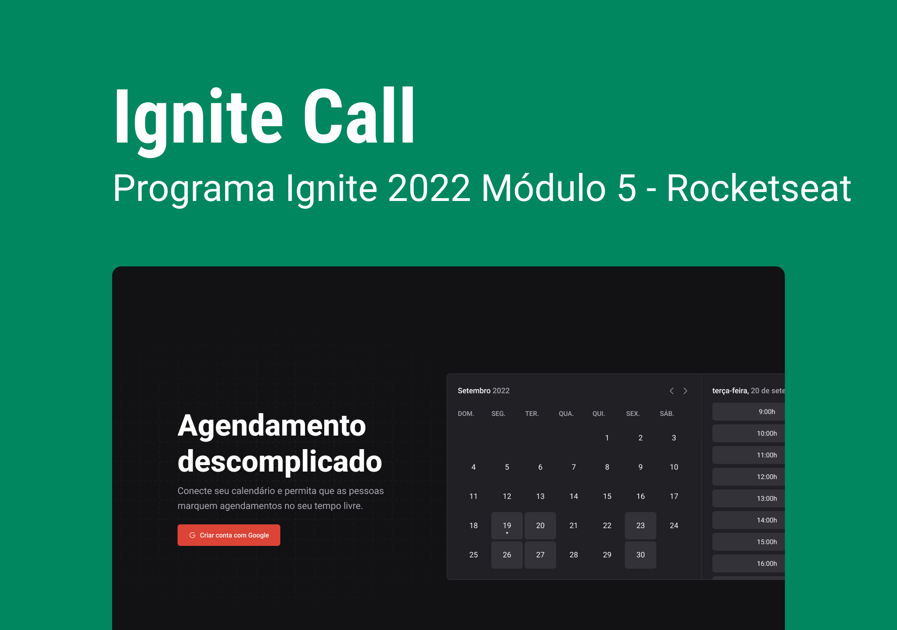

# Design System e Integração com o Storybook


Nesse módulo além de entendermos os conceitos de **Design System** e estruturarmos um do absoluto zero, iremos aprender também sobre **monorepo**, **turbo-repo** e muitas outras coisas.

## Design System

Os Design system são utilizados para que os padrões de layout sejam obedecidos, onde o design system se torna a documentação dos padrões do layout.

O Design System é o componente visual que pode ser compartilhado entre qualquer aplicação da empresa. Caso o componente em questão não possa ser compartilhado entre alguma das aplicações que a empresa possua, ele não fará parte do design system, mas sim, dentro de um **UI Kit (conjunto de componentes menores com componentes utilizados em aplicações específicas)**.

**Exemplos de Design System:**

- **Microsoft** - Fluent Design System
- **Uber** - Base Web

Nesse módulo desenvolveremos o design system baseado nos componentes do figma: [**Ignite Call**](https://www.figma.com/file/lFk4kPW69PnrlCX7vz0Laj/Ignite-5-2022---Ignite-Call).

## Iniciando o design system

Geralmente quando trabalhamos com a criação de um design system, queremos que o mesmo possa ser compartilhado para diferentes tipos de aplicação, por esse, motivo e também a manutenção dividimos o projeto em várias subpastas, cada uma com uma identidade própria.

→ Criar uma pasta chamada `packages` , pois o design system estará dividido entre vários pacotes. → Dentro dessa pasta criar a pasta `tokens` , na pasta token:

`npm init -y`

No arquivo package o name do arquivo é geralmente seguido por **@nome-organização/pacote, é ele que identificará o nosso pacote quando formos publicar no npm, então é bom algo que seja único.**

```jsx
"name": "@ignite-ui/tokens",
```

A pasta tokens cuidará de todas as variáveis do nosso sistema, dentro dela criar a pasta `src` e dentro os arquivos das `variáveis`, separados por tipos.

[packge tokens](/packages/tokens/)

Como por padrão iremos utilizar o typescript, será necessário ter a dependência, instalada, ainda na pasta tokens:

→ Instalar o Typescript: `npm i typescript`

→ Inicializar o mesmo: `npx tsc —init`

### **Build do pacote com TSUP**

**tsup -** o TSUP é uma ferramenta capaz de fazer a conversão do código `.ts`, em um arquivo javascript que estará disponível para outras aplicações, ele é utilizado no lugar do **tsc do typescript**, pois ele consegue manter variais versões de compatibilidade, **além de ser mais rápido, pois é baseado no esbuild que é o padrão do vite.**

→ Instalar `npm i tsup -D`

E criar o seguinte script no **packages.json**

```json
"scripts": {
  "build": "tsup src/index.ts --format esm,cjs --dts",
	"dev": "tsup src/index.ts --format esm,cjs --dts --watch"
},
```

Executar o `npm run build`, para ele gerar nossa dist dos tokens.

Enquanto o script de `dev` irá monitorar os arquivos e gerar uma nova build a cada alteração.

### **Configurando Monorepo**

O **Monorepo** é um conceito introduzido no javascript. Na prática **um monorepo** **é quando precisamos colocar vários projetos dentro de um único repositório de código**, uma mesma pasta de trabalho. **Utilizamos essa técnica principalmente quando temos projetos que são dependentes entre si.**

Suponhamos que nesse Design Sytem teremos outra pasta chamada de **react,** que irá conter a estrutura visual dos componentes da aplicação, mas ele dependerá ativamente dos padrões estabelecidos pelos pacote de tokens. 

Para isso funcionar, devemos voltar para a pasta no mesmo nível que se encontra a packages e novamente iniciar um projeto node com `npm init -y`. O arquivo package da raiz será um pouco diferente, ele precisará conter a seguinte estrutura e apenas isso:

```jsx
{
  "private": true, // informa que o pacote é privado, ele não será publicado
  "name": "design-system",
  "workspaces": [
    "packages/*"
  ]
}
```

→ Após isso dentro pasta do pacote react devemos indicar no `package.json` os pacotes aos quais ele irá depender:

```jsx
"devDependencies": {
    "@ignite-ui/tokens": "*",

```

Após isso se o comando `npm install` for executado a pasta node_modules será criada apenas uma única vez na matriz do programa.

Além disso, também devemos configurar como os arquivos serão acessados, criando mais 3 linhas de código no `packege.json`

```jsx
"main": "./dist/index.js",
"module": "./dist/index.mjs",
"types": "./dist/index.d.ts",
```

### **Configuração do TypeScript**

Criar uma pasta chamada **ts-config** e mudar o nome do `package.json` seguindo o padrão anterior: **`@ignite-ui/ts-config.`**

Criar um arquivo `base.json` que conterá as configurações do typescript e outro arquivo `react.json` que contará as configurações do typescript voltadas para o ambiente react.

Após isso fazer a referencia nos demais pacotes que irão usar as configurações do typescript.

Na pasta **tokens** dentro do arquivo `tsconfig.json` fazer um extends com as configurações já definidas do typescript em `base.json`.

```jsx
{
 "extends": "@ignite-ui/ts-config/base.json",
 "include": ["src"],
}
```

### **Configuração do ESLint**

Seguindo o mesmo padrão criar uma past `eslint-config`, iniciar o node e definir conforme:

```jsx
{
  "name": "@ignite-ui/eslint-config",
  "license": "MIT",
  "private": true,
  "main": "index.js",
  "devDependencies": {
    "@rocketseat/eslint-config": "^1.1.3", // -> estaremos utilizando uma configuração de eslint da rocketseat
    "eslint": "^8.26.0"
  }
}
```

Nos outros pacotes que forem utilizar o **eslint**, faremos a importação dos mesmo. 

Após isso criar um arquivo index que será responsavel por importar as configurações da rocketseat para o eslint.

```jsx
module.exports = {
  extends: ["@rocketseat/eslint-config/react"]
}
```

Nos demais pacotes que estiverem utilizando o eslint, criar um arquivo de configuração `.eslintrc.json`

```jsx
module.exports = {
  extends: ['@ignite-ui/eslint-config'],
}
```

Após isso poderemos criar um lint nos pacotes

```jsx
"lint": "eslint src/**/*.ts* --fix"
```